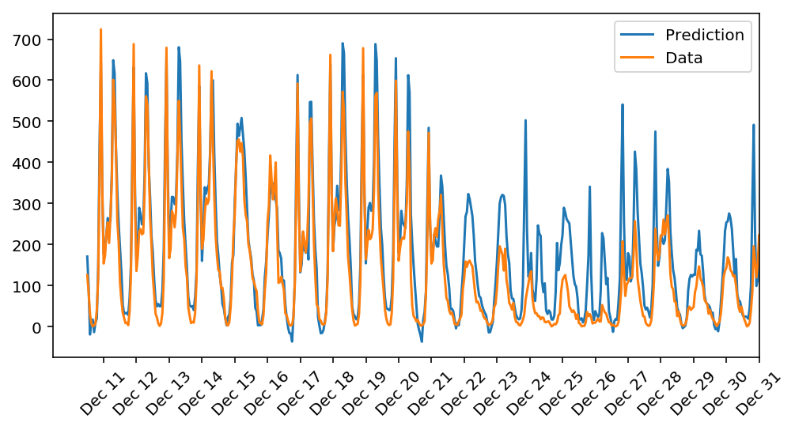

# Predicting Bike-Sharing Data (My First Neural Network)

In this project, we'll get to build a neural network from scratch to carry out a prediction problem on a real dataset! By building a neural network from the ground up, we'll have a much better understanding of gradient descent, backpropagation, and other concepts that are important to know before we move to higher-level tools such as PyTorch. We'll also get to see how to apply these networks to solve real prediction problems!

The data comes from the [UCI Machine Learning Database](https://archive.ics.uci.edu/ml/datasets/Bike+Sharing+Dataset).

## Rubrics

This project meets all the specifications, which are:

### Code Functionality
- [x] All the code in the notebook runs in Python 3 without failing, and all unit tests pass.
- [x] The sigmoid activation function is implemented correctly

### Forward Pass
- [x] The forward pass is correctly implemented for the network's training.
- [x] The run method correctly produces the desired regression output for the neural network.

### Backward Pass
- [x] The network correctly implements the backward pass for each batch, correctly updating the weight change.
- [x] Updates to both the input-to-hidden and hidden-to-output weights are implemented correctly.

### Hyperparameters
- [x] The number of epochs is chosen such the network is trained well enough to accurately make predictions but is not overfitting to the training data.
- [x] The number of hidden units is chosen such that the network is able to accurately predict the number of bike riders, is able to generalize, and is not overfitting.
- [x] The learning rate is chosen such that the network successfully converges, but is still time efficient.
- [x] The number of output nodes is properly selected to solve the desired problem.
- [x] The training loss is below 0.09 and the validation loss is below 0.18.

# Result
---

> The model is quite good at predicting the number of riders from the start of Dec 11 until the end of Dec 20, because the lines coincide with each other, thus resulting in small error. Towards the end of the year, the model is bad at predicting the number of rides - it tends to predict with a greater number than the actual. Maybe because there are upcoming two big public holidays which are Christmas and New Year Eve but in our data denoted with `holiday = 1` which is treated the same as regular holidays such as Presidents' day or Labor day. So our network couldn't capture this information from the data.