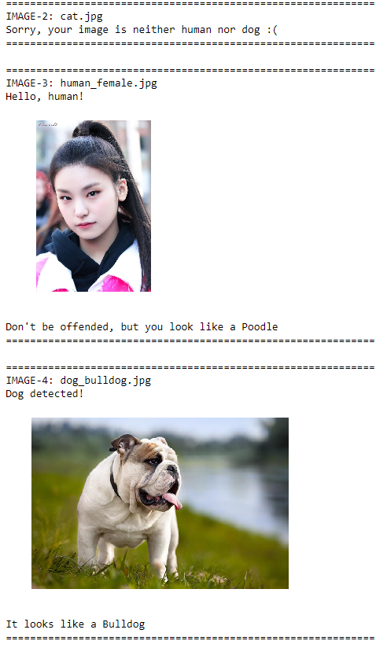

# Dog Breed Classifier

Welcome to the Convolutional Neural Networks (CNN) project in the AI Nanodegree! In this project, we will learn how to build a pipeline that can be used within a web or mobile app to process real-world, user-supplied images. Given an image of a dog, our algorithm will identify an estimate of the canine’s breed. If supplied an image of a human, the code will identify the resembling dog breed.

Along with exploring state-of-the-art CNN models for classification and localization, we will make important design decisions about the user experience for our app. Our goal is that by completing this lab, we understand the challenges involved in piecing together a series of models designed to perform various tasks in a data processing pipeline. Each model has its strengths and weaknesses, and engineering a real-world application often involves solving many problems without a perfect answer. The imperfect solution will nonetheless create a fun user experience!

## Rubrics

This project meets all the specifications, which are:

### Files Submitted
- [x] The submission includes all required, complete notebook files.

### Step 1: Detect Humans
- [x] The submission returns the percentage of the first 100 images in the dog and human face datasets that include a detected, human face.

### Step 2: Detect Dogs
- [x] Use a pre-trained VGG16 Net to find the predicted class for a given image. Use this to complete a `dog_detector` function below that returns True if a dog is detected in an image (and False if not).
- [x] The submission returns the percentage of the first 100 images in the dog and human face datasets that include a detected dog.

### Step 3: Create a CNN to Classify Dog Breeds (from Scratch)
- [x] Write three separate data loaders for the training, validation, and test datasets of dog images. These images should be pre-processed to be of the correct size.
- [x] Answer describes how the images were pre-processed and/or augmented.
- [x] The submission specifies a CNN architecture.
- [x] Answer describes the reasoning behind the selection of layer types.
- [x] Choose appropriate loss and optimization functions for this classification task. Train the model for a number of epochs and save the "best" result.
- [x] The trained model attains at least 10% accuracy on the test set.

### Step 4: Create a CNN Using Transfer Learning
- [x] The submission specifies a model architecture that uses part of a pre-trained model.
- [x] The submission details why the chosen architecture is suitable for this classification task.
- [x] Train your model for a number of epochs and save the result wth the lowest validation loss.
- [x] Accuracy on the test set is 60% or greater.
- [x] The submission includes a function that takes a file path to an image as input and returns the dog breed that is predicted by the CNN.

### Step 5: Write Your Algorithm
- [x] The submission uses the CNN from the previous step to detect dog breed. The submission has different output for each detected image type (dog, human, other) and provides either predicted actual (or resembling) dog breed.

### Step 6: Test Your Algorithm
- [x] The submission tests at least 6 images, including at least two human and two dog images.
- [x] Submission provides at least three possible points of improvement for the classification algorithm.

## Results

### Self-specified CNN architecture:
- Test Loss: 3.717625
- Test Accuracy: 13% (115/836)

### Transfer learning (ResNet50):
- Test Loss: 0.469070
- Test Accuracy: 86% (719/836)

### Sample images

The prediction output is quite accurate:
- `human_male.jpg` and `human_female.jpg` are correctly classified as human faces.
- `cat.jpg` and `vegetables_face.jpg` are correctly rejected as neither human nor dog.
- `dog_bulldog.jpg` is correctly classified as dog, and also correctly classified as Bulldog.
- `dog_siberian_husky.jpg` is correcly classified as dog, but classified as Alaskan Malamute since there is no "Siberian Husky" class in class_names (but both are quite similar though).

### Possible improvements

- Use different parameter settings (hyperparameter tuning), such as different architecture (number of layers and nodes, dropouts, normalization, etc), weight initialization, optimizer, learning rate, batch size.
- Add more image datasets of dog breeds and the class of dog breeds.
- Do another image augmentation (rotate, shear, move, etc) will further improve the model generalization performance.
- Use ensemble learning methods for CNN (but this needs more computation time).