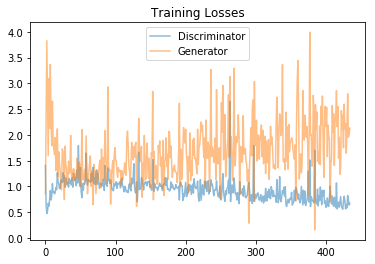
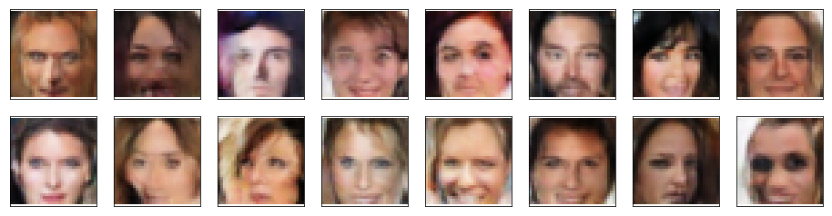

# Generate Faces

In this project, we'll define and train a DCGAN on a dataset of [CelebFaces Attributes Dataset (CelebA)](http://mmlab.ie.cuhk.edu.hk/projects/CelebA.html). The goal is to get a generator network to generate *new* images of faces that look as realistic as possible!

The project will be broken down into a series of tasks from **loading in data to defining and training adversarial networks**. At the end of the notebook, we'll be able to visualize the results of the trained Generator to see how it performs; the generated samples should look like fairly realistic faces with small amounts of noise.

## Rubrics

This project meets all the specifications, which are:

### Required Files and Tests
- [x] The project submission contains the project notebook, called “dlnd_face_generation.ipynb”.
- [x] All the unit tests in project have passed.

### Data Loading and Processing
- [x] The function get_dataloader should transform image data into resized, Tensor image types and return a DataLoader that batches all the training data into an appropriate size.
- [x] The `get_dataloader` function has been implemented correctly. Nice work resizing all images to 32. :thumbsup:
- [x] Pre-process the images by creating a `scale` function that scales images into a given pixel range. This function should be used later, in the training loop.

### Build the Adversarial Networks
- [x] The Discriminator class is implemented correctly; it outputs one value that will determine whether an image is real or fake.
- [x] The Generator class is implemented correctly; it outputs an image of the same shape as the processed training data.
- [x] This function should initialize the weights of any convolutional or linear layer with weights taken from a normal distribution with a mean = 0 and standard deviation = 0.02.

### Optimization Strategy
- [x] The loss functions take in the outputs from a discriminator and return the real or fake loss.
- [x] There are optimizers for updating the weights of the discriminator and generator. These optimizers should have appropriate hyperparameters.

### Training and Results
- [x] Real training images should be scaled appropriately. The training loop should alternate between training the discriminator and generator networks.
- [x] There is not an exact answer here, but the models should be deep enough to recognize facial features and the optimizers should have parameters that help wth model convergence.
- [x] The project generates realistic faces. It should be obvious that generated sample images look like faces.
- [x] The question about model improvement is answered.

## Results

### Training Losses
The training losses for the generator and discriminator, recorded after each epoch:

### Generated Faces
Generated sample of images from the generator:

### Ideas for Improvement

1. Observation: Low-resolution image

    Solution: use a higher resolution dataset (but the training process will be slower), might consider using SRGAN (Super Resolution GAN) for a better resolution.

2. Observation: Generated faces are white. Our model only learns the feature of white people, instead of various races.

    Solution: Train the model on a balanced image dataset for all races (whites and non-whites). Also collect faces for non-celebrity, so that our model doesn't bias only towards the Hollywood beauty standards. Besides, we can preprocess the image so that the background color is the same throughout the dataset.

3. Observation: Flawed face, the generated faces are not symmetrical.

    Solution: Use a deeper network so that our model learn more complex face characteristics or features, and train with more epochs. Also, we can categorize the dataset into several categories based on skin color or sex.

4. Observation: The trend for training losses generator is increasing.

    Solution: try hyperparameter tuning, especially on the `lr`, `beta1`, and `beta2`