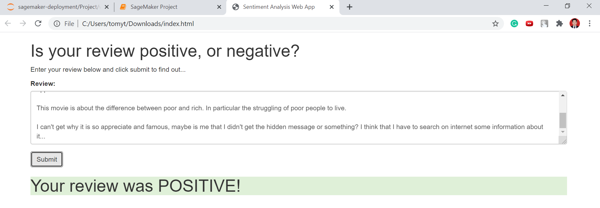
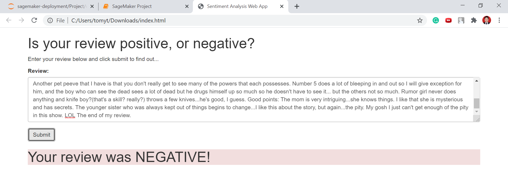

# SageMaker Deployment Project

Welcome to the SageMaker deployment project! In this project we will construct a recurrent neural network (LSTM) for the purpose of determining the sentiment of a movie review using the [IMDB data set](http://ai.stanford.edu/~amaas/data/sentiment/). We will create this model using Amazon's SageMaker service. In addition, we will deploy the trained model and construct a simple web app which will interact with the deployed model using AWS Lambda and API Gateway.

## Table of Content

- `cache/sentiment_analysis`: Pickle of preprocessed dataset
- `data`:
    - `aclImdb`: Data set downloaded from [here](http://ai.stanford.edu/~amaas/data/sentiment/)
    - `pytorch`: Pickle of word dictionary and csv of processed training dataset
- `Project`:
    - `result`: Screenshot of web app
    - `serve`: Custom inference code to be deployed
    - `train`: Custome training code to be deployed
    - `website`: Static web app

## Rubrics

This project meets all the specifications, which are:

### Files Submitted
- [x] The submission includes all required files, including notebook, python scripts and html files.

### Preparing and Processing Data
- [x] Answer describes what the pre-processing method does to a review.
- [x] The `build_dict` method is implemented and constructs a valid word dictionary.
- [x] Notebook displays the five most frequently appearing words.
- [x] Answer describes how the processing methods are applied to the training and test data sets and what, if any, issues there may be.

### Build and Train the PyTorch Model
- [x] The train method is implemented and can be used to train the PyTorch model.
- [x] The RNN is trained using SageMaker's supported PyTorch functionality.

### Deploy the Model for Testing
- [x] The trained PyTorch model is successfully deployed.

### Use the Model for Testing
- [x] Answer describes the differences between the RNN model and the XGBoost model and how they perform on the IMDB data.
- [x] The test review has been processed correctly and stored in the `test_data` variable.
- [x] The `predict_fn()` method in `serve/predict.py` has been implemented.

### Deploying the Web App
- [x] The model is deployed and the Lambda / API Gateway integration is complete so that the web app works (make sure to include your modified `index.html`).
- [x] Answer gives a sample review and the resulting predicted sentiment.

## Results

- Model accuracy on test dataset: 0.85656

- Use the static `website/index.html` web application to predict sentiment based on user input:

    - Review 1 from [francescodecarli on "Parasite"](https://www.imdb.com/review/rw6049499/) (7/10 stars)

    

    - Review 2 from [sherripadgitt on "The Umbrella Academy"](https://www.imdb.com/review/rw6040663) (4/10 stars)

    